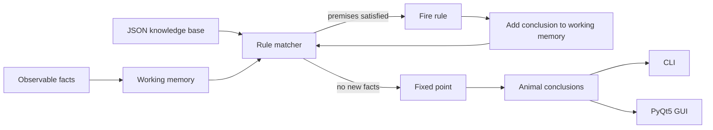

# Architecture

The project separates the **knowledge base**, **inference engine**, and **presentation layer** so that reasoning can be tested independently from the GUI.



## Core modules

- `knowledge_base.py` loads and validates concepts and rules from JSON.
- `engine.py` performs deterministic forward chaining to a fixed point.
- `models.py` defines immutable domain models for rules, steps, and results.
- `cli.py` exposes a dependency-free command-line interface.
- `gui.py` provides an optional bilingual PyQt5 desktop interface.

## Reasoning algorithm

Given an initial set of observable facts `F`, the engine repeatedly scans the rule set. A rule

`P1 ∧ P2 ∧ ... ∧ Pn → C`

fires when all premises are already in working memory and `C` is not. The conclusion is added to working memory immediately. The process repeats until a complete pass produces no new facts.

This fixed-point iteration supports **multi-hop inference**. For example:

```text
has hair -> mammal
 eats meat -> carnivore
mammal + carnivore + tawny + dark spots -> leopard
```

The 2022 prototype checked rules against only the user's original input. The 2026 refactor explicitly feeds inferred facts back into working memory, so later rules can depend on earlier conclusions.
